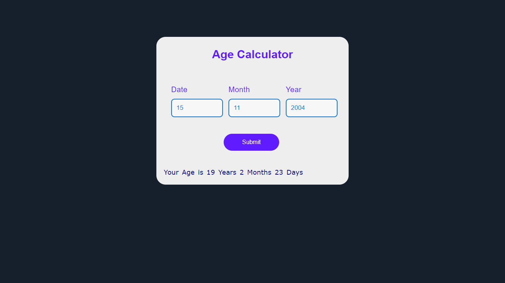

<h1 align="center">Age Calculator</h1>

  
<a href="https://github.com/U7P4L-IN/Age-Calculator/issues">

  
</a>
 

<h2 align="center">This Is Age Calculator.</h2>

> [!NOTE]
> The age calculator calculates age given a date of birth in years, months and days. You can also use this calculator to find length of time between two dates.

> The age calculator finds the age time span in years months and days, months and days, and in total days only.

  

- [Live Demo](https://u7p4l-in.github.io/Age-Calculator/)
 

Made with html,css and js

Copyright © 2024-Author U7P4L !N

  

